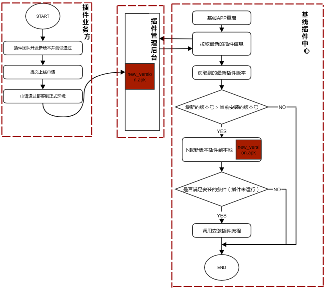
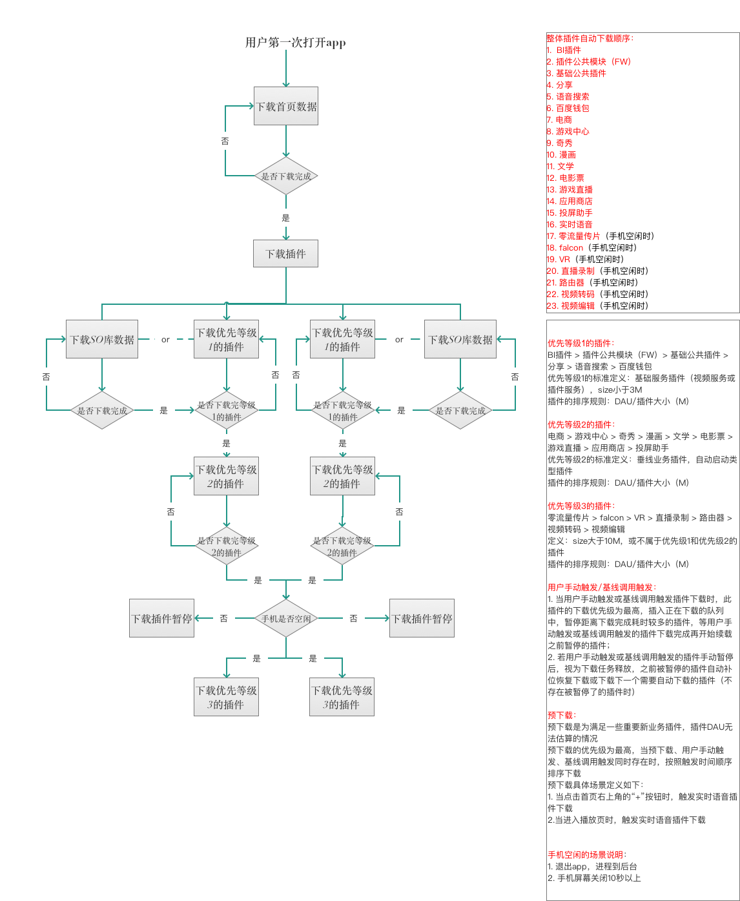
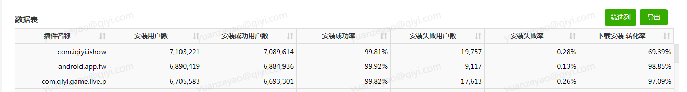
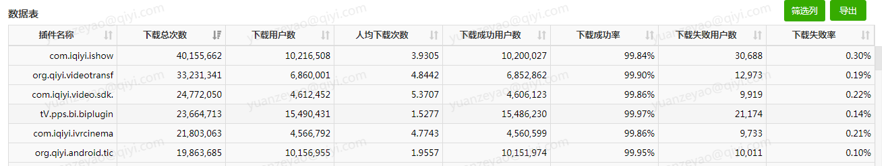

# 插件下载

## 一、下载概括图

## 二、网络下载限制
蜂窝下静默下载包含两种情况:
启动app触发蜂窝下自动下载 或 wifi切换成蜂窝后 继续下载。

以下三个维度需云控：  
1、对每个插件可分别配置是否允许蜂窝下下载。7.6仅打开阅读和奇秀开关。  
2、4G、3G两种网络可独立配置是否允许静默下载，若开启，则需满足网络与流量限制大小对应关系：4G -> 5M; 3G ->3M。后端配置插件开关时需检查插件总大小。
7.6默认只开启4G下静默下载。  
3、允许蜂窝下静默下载同一个插件的最高频率可云控，初始值为7天一次。

备注：下载失败固定重试3次（断点续下，不是从头下，不多消耗流量）

## 三、下载优先级顺序

插件下载的优先级策略依照产品需求： [BASELINEREQ-4589](http://pms.qiyi.domain/browse/BASELINEREQ-4589?src=confmacro) - 认证 查看问题详情  
说明文档：[安卓插件下载优先级策略PRD.docx](http://wiki.qiyi.domain/download/attachments/161080491/%E5%AE%89%E5%8D%93%E6%8F%92%E4%BB%B6%E4%B8%8B%E8%BD%BD%E4%BC%98%E5%85%88%E7%BA%A7%E7%AD%96%E7%95%A5PRD.docx?version=1&modificationDate=1511422627000&api=v2)

插件下载优先级定义，目前分为0， 1， 2， 3四个优先级，数字越大，下载优先级越低。  

| 优先级 | 含义 |
| :--- | :----: |
| 0 | 独立线程下载，无需排队 |
| 1 | 第一优先级队列      |
| 3 | 第三优先级队列，需等待第一、二优先级队列任务下载完成 |
| 2 | 第二优先级队列，需等待第一优先级队列任务下载完成 |

## 四、下载产品逻辑图

## 五、下载触发时机

- 启动时，延后1s后，自动下载
- 插件管理中心，手动下载
- 增量patch merger 失败时，自动下载

## 六、插件下载和安装统计方法

报表查看地址：http://bi.qiyi.domain  

安装报表各列计算方法：

插件名称：插件包名  
安装用户数：数据库中dotype = 2的item，也就是某一时间段中收到的安装类型投递(包括安装成功和安装失败)  
安装成功用户数：dotype= 2 & status = 1 ,某一时间段内收到的安装成功的投递  
安装成功率：安装成功用户数/安装用户数  
安装失败用户数：dotype = 2 & status = 0,某一时间段内收到的安装失败的投递  
安装失败率：安装失败用户数/安装用户数  
下载安装转化率：某一时间段内安装成功用户数/某一时间段内下载的用户数  

下载报表各列计算方法如下：  

插件名称:插件包名  
下载总次数：某一个时间段内插件下载的总次数，包含成功和失败次数  
下载用户数：下载总次数对设备去重  
人均下载次数：下载总次数/下载用户数  
下载成功用户数：doType = 1 & status = 1,代表下载成功的投递  
下载成功率：下载成功用户数/下载用户数  
下载失败用户数：doType = 1 & status = 0,代表下载失败的投递  
下载失败率：下载失败用户数/下载用户数
