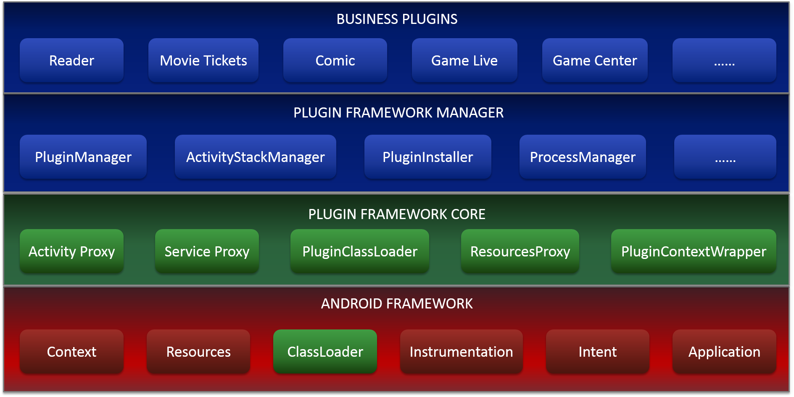

# Neptune


**Neptune is a flexible, powerful and lightweight plugin framework for Android developed by IQIYI Baseline Team.**

It can dynamically load and run a plugin APK file on billions of devices. It carries more than 20 separated business module of IQIYI, such as reader, movie tickets, live videos, and so on.

When Android P is arriving, we meet the non-sdk strict challenge on P. And now, Neptune can run on Android P devices seamless with only **ONE** hook (Instrumentaion in ActivityThread, same idea with other great plugin frameworks).

[中文文档](http://gitlab.qiyi.domain/mobile-android/baseline-sh/QYPlugin/blob/sdk_open/README_CN.md)

# Supported Features

| Feature | Detail  |
| :------ | :-----: |
| Supported Components | Activity/Service/Receiver |
| Component registration in Host Manifest.xml | No Need |
| Share Host App Class | Supported |
| Share Host App Resources | Supported |
| Resources Isolation | Supported |
| Run individual App | Supported |
| Android Features | Almost all features |
| Compatibility  | Almost all roms |
| Process Isolation | Supported |
| Plugin Dependency   | Supported |
| Plugin Develop  | like normal app |
| Supported Android versions | API Level 14+ |

# Architecture



# Getting Started

## Host Project

compile Neptune in application module of `build.gradle`.

```Gradle
    compile 'com.iqiyi.video:neptune:2.5.0'
```

Initialize sdk in your `Application#onCreate()`.

```Java
public class XXXApplication extends Application {
    
    @Override
    public void onCreate() {
        NeptuneConfig config = new NeptuneConfig.NeptuneConfigBuilder()
                    .configSdkMode(NeptuneConfig.INSTRUMENTATION_MODE)
                    .enableDebugMode(BuildConfig.DEBUG)
                    .build();
        Neptune.init(this, config);
    }
}
```

more details and developer guide see wiki

## Plugin Project

If plugin app wants to share resources with host app, you need add dependency in the `buildscript` block of `build.gradle` in root of plugin project as following.

```Gradle
dependencies {
    classpath  'com.iqiyi.tools.build:plugin-gradle:1.0.7'
}
```

Apply gradle plugin in application module of `build.gradle` and config it.

```Gradle
apply plugin: 'com.qiyi.plugin'

neptune {
    pluginMode = true      // In plugin apk build mode
    packageId = 0x30       // The packge id of Resources
    hostDependencies = "{group1}:{artifact1};{group2}:{artifact2}" // host app resources dependencies
}
```

# Developer Guide

* API document wiki
* Host App Sample Project
* Plugin App Sample Project
* Read SDKLibrary source code

# Contribution

We sincerely welcome and appreciate your PR contribution of any kind including code, suggestions or documentaion to improve the project. 

# License

Neptune is [Apache v2.0 Licensed](LICENSE.md).

