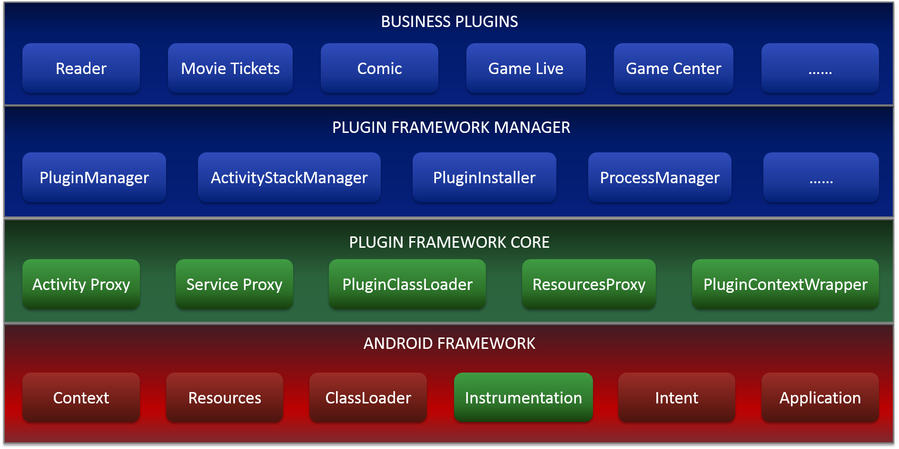

# Neptune


**Neptune is a flexible, powerful and lightweight plugin framework for Android developed by IQIYI.**

It can load and run any plugin APK file dynamically on billions of devices. It carries tens of separated business module of IQIYI, such as reader, movie tickets, live videos, and so on.

With the public testing and release of Android P, we meet the restrictions on non-SDK interfaces. Until now, Neptune is compatible with Android P and bare APIs in light grey list are used. Neptune can run on Android P devices seamless and stably.

[中文文档](README_CN.md)

# Android P Compatibility

Only android private APIs in light grey list are used in Neptune. No APIs in dark grey or black list.

| API List | API Used cnt |
| :----    | :---- |
| Black list | 0 |
| Dark grey list | 0 |
| light grey list | 9 |

### Details

```
Accessing hidden field Landroid/app/ActivityThread;->mInstrumentation:Landroid/app/Instrumentation; (light greylist, reflection)
Accessing hidden method Ldalvik/system/VMRuntime;->getCurrentInstructionSet()Ljava/lang/String; (light greylist, reflection)
Accessing hidden method Landroid/content/res/AssetManager;->addAssetPath(Ljava/lang/String;)I (light greylist, reflection)
Accessing hidden method Landroid/app/Instrumentation;->execStartActivity(Landroid/content/Context;Landroid/os/IBinder;Landroid/os/IBinder;Landroid/app/Activity;Landroid/content/Intent;ILandroid/os/Bundle;)Landroid/app/Instrumentation$ActivityResult; (light greylist, reflection)
Accessing hidden field Landroid/view/ContextThemeWrapper;->mResources:Landroid/content/res/Resources; (light greylist, reflection)
Accessing hidden field Landroid/app/Activity;->mApplication:Landroid/app/Application; (light greylist, reflection)
Accessing hidden field Landroid/content/ContextWrapper;->mBase:Landroid/content/Context; (light greylist, reflection)
Accessing hidden field Landroid/app/Activity;->mInstrumentation:Landroid/app/Instrumentation; (light greylist, reflection)
Accessing hidden field Landroid/app/Activity;->mActivityInfo:Landroid/content/pm/ActivityInfo; (light greylist, reflection)
```

Besides `ActivityThread#mInstrumentation` and `AssetManager#addAssetPath()` must be hooked, other APIs in light grey list, we also provided another way to avoid risk. We provide some basic `PluginActivity` for plugin apk to inherit and change Activity's parent in plugin when building plugin apk with gradle plugin.

# Supported Features

| Feature | Detail  |
| :------ | :-----: |
| Supported Components | Activity/Service/Receiver |
| Component registration in Host Manifest.xml | No Need |
| Share Host App Class | Supported |
| Share Host App Resources | Supported |
| Resources Isolation | Supported |
| Run individual App | Supported |
| Android Features | Almost all features |
| Compatibility  | Almost all roms |
| Process Isolation | Supported |
| Plugin Dependency   | Supported |
| Plugin Development  | like normal app |
| Supported Android versions | API Level 14+ |

# Architecture



# Getting Started

## Host Project

compile Neptune in application module of `build.gradle`.

```Gradle
    compile 'org.qiyi.video:neptune:2.5.0'
```

Initialize sdk in your `Application#onCreate()`.

```Java
public class XXXApplication extends Application {
    
    @Override
    public void onCreate() {
        NeptuneConfig config = new NeptuneConfig.NeptuneConfigBuilder()
                    .configSdkMode(NeptuneConfig.INSTRUMENTATION_MODE)
                    .enableDebug(BuildConfig.DEBUG)
                    .build();
        Neptune.init(this, config);
    }
}
```

more details and developer guide see wiki

## Plugin Project

If plugin app wants to share resources with host app, you need add dependency in the `buildscript` block of `build.gradle` in root of plugin project as following.

```Gradle
dependencies {
    classpath  'com.iqiyi.tools.build:neptune-gradle:1.1.0'
}
```

Apply gradle plugin in application module of `build.gradle` and config it.

```Gradle
apply plugin: 'com.qiyi.neptune.plugin'

neptune {
    pluginMode = true      // In plugin apk build mode
    packageId = 0x30       // The packge id of Resources
    hostDependencies = "{group1}:{artifact1};{group2}:{artifact2}" // host app resources dependencies
}
```

# Developer Guide

* [API document wiki](http://gitlab.qiyi.domain/mobile-android/baseline-sh/QYPlugin/wikis/home)
* [Host App Sample Project](samples/HostApp)
* [Plugin App Sample Project](samples/PluginApp)
* [Read SDKLibrary source code](SdkLibrary)

# Contribution

We sincerely welcome and appreciate your PR contribution of any kind including code, suggestions or documentaion to improve the project. 

# License

Neptune is [Apache v2.0 Licensed](LICENSE.md).

